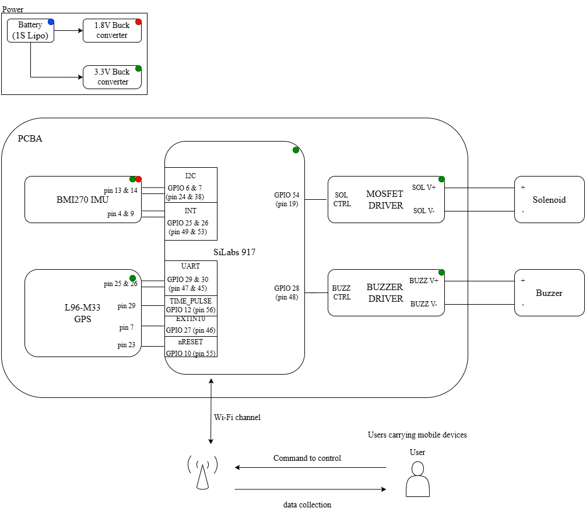
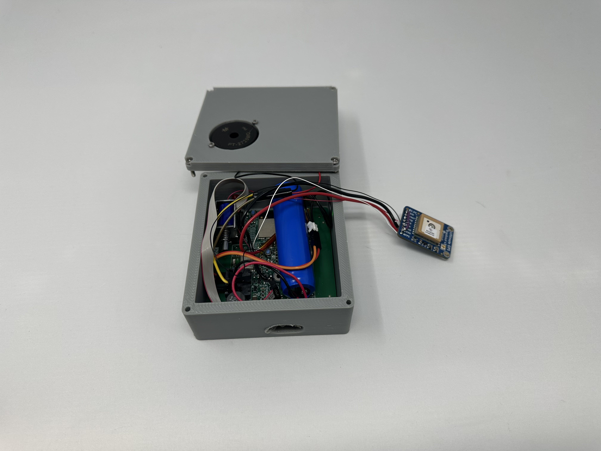
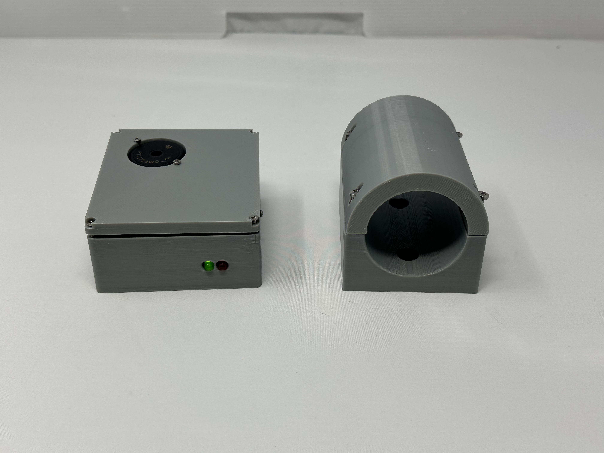
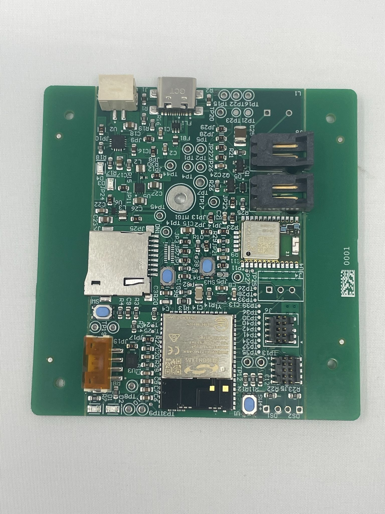
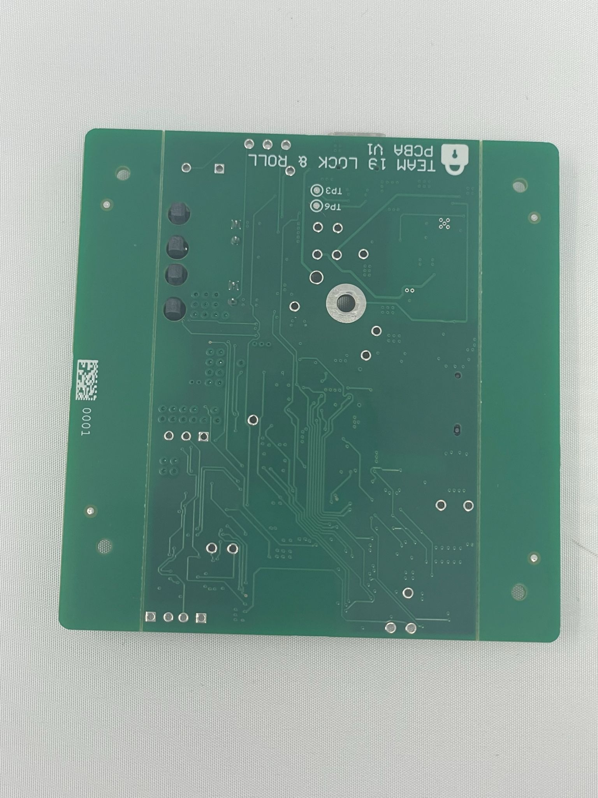
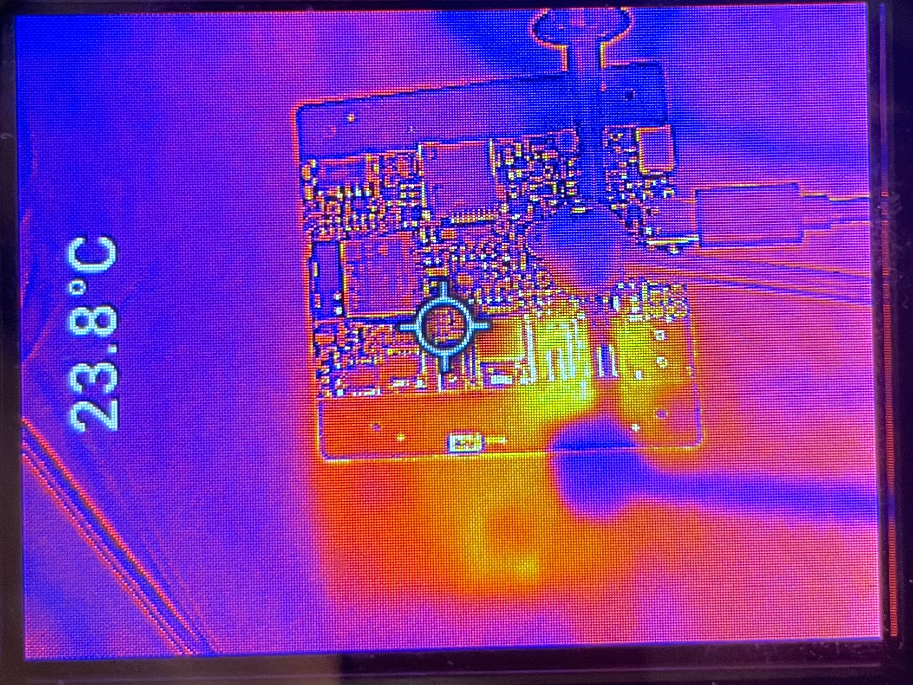
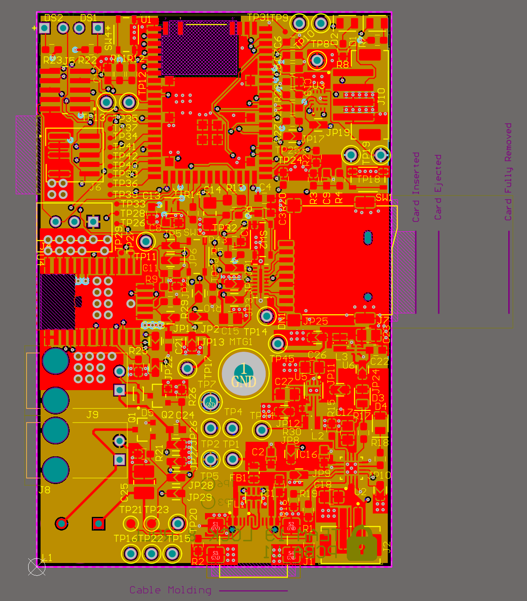
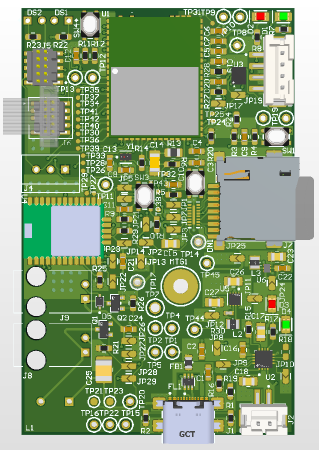
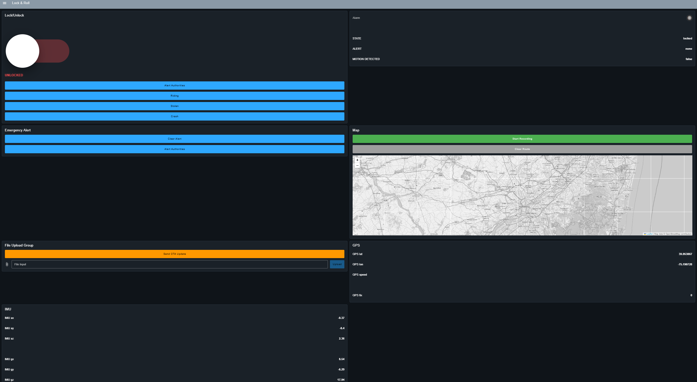
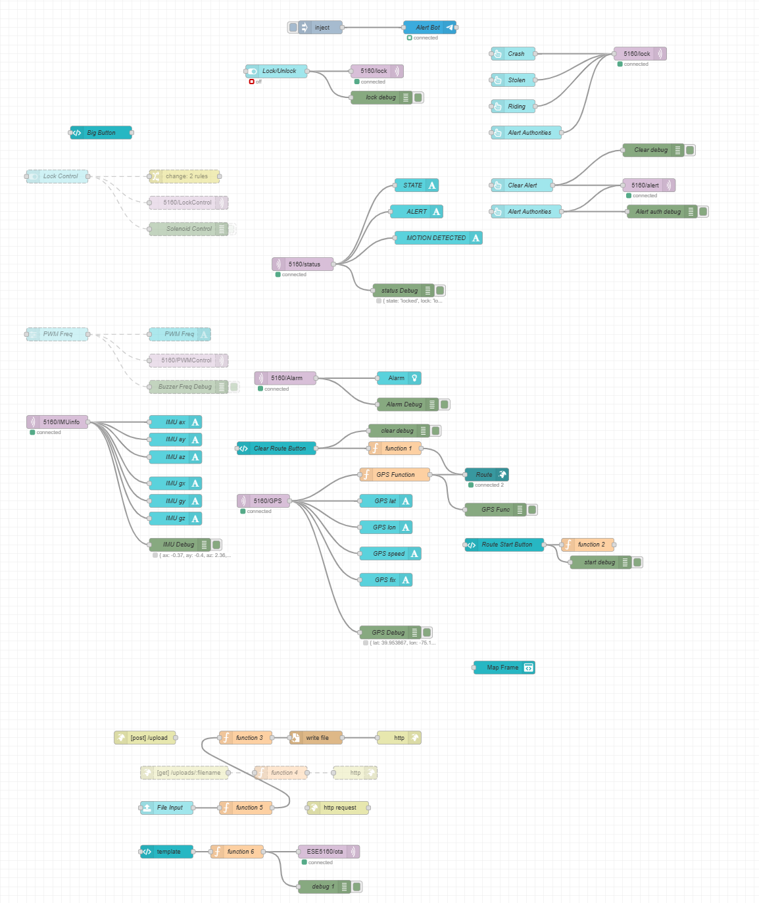

# a11g-final-submission

**Team Number: 19**

**Team Name: Lock & Roll**

| Team Member Name |     Email Address    | GitHub Username |
| ---------------- | -------------------- | --------------- |
|   Owen Ledger    |oledger@seas.upenn.edu|    oledger9     |
|   Zexin Feng     |zexinf@seas.upenn.edu |    ZexinF666    |

**GitHub Repository URL: https://github.com/ese5160/a11g-final-submission-s26-s26-t19-lock-roll.git**

## 1. Video Presentation

[demo_video](https://youtu.be/UMkgU2Nrok4)

## 2. Project Summary

### 2.1 Device Description

Our device is an intelligent bicycle lock that can be controlled either automatically or via the cloud. The entire equipment can be switched between different modes (Riding, Stolen, Crash, Alert Authorities).

We were inspired by the need for a more intelligent and secure bike lock system, aiming to upgrade the existing popular bicycle locks. Compared with ordinary bike locks that only have a simple locking function, our equipment uses data collected by GPS and IMU to determine different modes and automatically activates the alarm and locking/unlocking functions. 

At the same time, it can monitor the status of the bicycle and the bike lock through the cloud, also control the alarm status and locking/unlocking functions. 

### 2.2 Device Functionality

The core of our internet-connected smart lock system is built around the SIWG917Y121MGABA microcontroller, which integrates Wi-Fi connectivity and manages interactions between local components and the cloud. This device integrates automatic data collection and monitoring, real-time security feedback, and remote access capabilities to deliver both convenience and safety.

- **Sensors and actuators**
On board IMU and GPS monitor data and compare it with the set thresholds. If a theft or crash accident is detected, the buzzer will be activated to alert the user and solenoid will lock the bicycle when in stolen mode.

- **Internet-Enhanced Features**
The device connects to the internet to support remote lock/unlock, allowing users to monitor real-time status data and control access even when they are not physically present.

To aid in understanding the overall structure and flow of the system, a system-level block diagram is included below, illustrating the interactions among the microcontroller, sensors, actuators, and network interface.

### 2.3 Challenges

Our main challenge in terms of hardware is the limited area of the PCB, so we have to make trade-offs at the test points. This also poses a challenge for the subsequent hardware testing after the PCBA is delivered. Due to the lack of proper test points, manual power testing needs to be conducted on the small pad.

In terms of the software, the networking function of GPS is not stable. Due to unknown reasons, Wi-Fi cannot connect to the device on some terminals. We eventually tried connecting different devices to Upenn's Wi-Fi and enabled the hotspot to solve this problem.

### 2.4 Prototype Learnings

In the process of building and developing the prototype, we learned that it is necessary to repeatedly confirm and modify the design and layout during the hardware design and verification stage. It would help us save a lot of time and work to debug device or find other ways to fix it. 

If we had to build this device again, we may try an active Wi-Fi antenna to make Wi-Fi connection better and we would redesign a larger housing for our device to fit in.

### 2.5 Next Steps & Takeaways

The future improvements mainly involve the Bluetooth module of SIWG917Y121MGABA. Our earlier idea also included a cool non-contact keylock function. The device can determine the distance via Bluetooth and automatically lock or unlock based on the set value. This will be an interesting feature and will allow for in-depth study of the Bluetooth functionality of this microcontroller. 

The ESE5160 course offers a complete learning process for design and verification, integrating embedded hardware design, software development, and system integration. During the learning process, we acquired knowledge of hardware circuits such as hardware design and PCB layout. Subsequently, in the software development stage, real-time programming based on FreeRTOS included task creation, priority management, and mutual lock for task synchronization. This experience bridged the gap between theory and practice and prepared us for the actual development of embedded systems.

### 2.6 Project Links

[Node-RED URL] (http://20.112.79.126:1880/dashboard/page1)

[PCBA on Altium 365] (https://upenn-eselabs.365.altium.com/designs/A8930AD8-77C0-46F9-A2AB-914F3C5A8D92)

## 3. Hardware & Software Requirements

### 3.1 Hardware Requirements:

**HRS 01:** The system shall use the Silicon Labs SIWG917Y121MGABA as the primary microcontroller and wireless communication module.

- **Met.** We successfully manufactured and used a customized PCB with the SIWG917Y121MGABA as the core controller.

**HRS 02:** The system shall include a 3-axis IMU communicating over an I2C interface to detect motion, vibration, and acceleration events.

- **Met.** We successfully manufactured and used a customized PCB with the BMI270 as the IMU.

**HRS 03:** The system shall include a locking actuator (motorized latch or solenoid) capable of mechanically securing the bicycle wheel or frame when the device is armed.

- **Met.** We use a solenoid (was driven using PWM from GPIO 28 and solenoid driver circuit) as our lock and it can be controlled successfully when in lock mode. 

**HRS 04:** The system shall include an audible alarm capable of producing at least 80 dB to deter unauthorized access or tampering.

- **Met.** We have a buzzer (was driven using PWM from GPIO 28 and buzzer driver circuit) with a volume higher than 80 dB and it can be controlled successfully when in alarm mode. 

**HRS 05:** The system shall include visual indicators (LEDs) to communicate lock status and alarm states to the user.

- **Met.** We set two LEDs to indicate different modes such as lock/unlock.

**HRS 06:** The system shall be powered by a single-cell 3.7 V Li-ion battery and include appropriate voltage regulation to supply 3.3 V to all components and 1.8V to IMU.

- **Met.** The power section works well and can be converted to 3.3V & 1.8V.

**HRS 07:** The locking actuator should be mechanically designed to resist common non-destructive tampering methods (e.g., shaking or wheel rotation).

- **Met.** We design and 3D print housing for the device and all componts are inside the box.

### 3.2 Software Requirements:

**SRS 01:** Shall contain automatic lock mode when the authorized user’s BLE device is no longer detected within a configurable proximity threshold.

- **Not Met.** We eventually gave up this option because we could control the lock's opening and closing through the cloud, which was more convenient and reliable. At the same time, it also reduces the probability of accidental activation.

**SRS 02:** When armed, the system shall continuously monitor IMU data to detect unauthorized movement or tampering.

- **Met.** After detecting the IMU vibration threshold, the buzzer is reliably activated within the detection range and lock the solenoid.

**SRS 03:** Upon detection of unauthorized movement, the system shall activate the audible alarm and upload a theft alert to the cloud within 5 seconds

- **Met.** Device will switch to alarm mode, the information can be uploaded to terminal and buzzer will be turned on in 5 seconds after detecting of unauthorized movement. 

**SRS 04:** During a ride, the system shall record speed, distance, acceleration, and route data.

- **Met.** When in ride mode, the data of IMU and GPS will be transmitted to the terminal in real time.

**SRS 05:** The system shall detect potential crashes by identifying high-magnitude acceleration events that exceed predefined thresholds.

- **Met.** When in ride mode and the data from the IMU triggers the set threshold range, the alarm will sound for 30 seconds. 

**SRS 06:** Upon crash detection, the system shall request user acknowledgment through the connected application.

- **Met.** If the user clears it manually at the terminal, the alarm mode will be deactivated.

**SRS 07:** The system should support secure over-the-air (OTA) firmware updates to allow feature improvements and bug fixes after deployment.

- **Met.** Firmware can be updated by uploading file at the terminal.

## 4. Project Photos & Screenshots

- Final Project  

- The standalone PCBA, top

- The standalone PCBA, bottom

- Thermal camera images

- The Altium Board design in 2D view

- The Altium Board design in 3D view

- Node-RED dashboard (screenshot)

- Node-RED backend (screenshot)

- Block diagram of your system

## 5. Codebase

Do *not* commit any of your source code to this repository. Rather, provide links to the other GitHub repository you've already been using with your firmware.

- A link to my final embedded C firmware codebases
https://github.com/ese5160/final-project-firmware-s26-t19-lock-roll-1.git

- A link to my Node-RED dashboard code
https://github.com/ese5160/a11g-final-submission-s26-s26-t19-lock-roll.git

- A link to my project webpage
https://ese5160.github.io/a11g-final-submission-s26-s26-t19-lock-roll/

- Links to any other software required for the functionality of your device
N/A